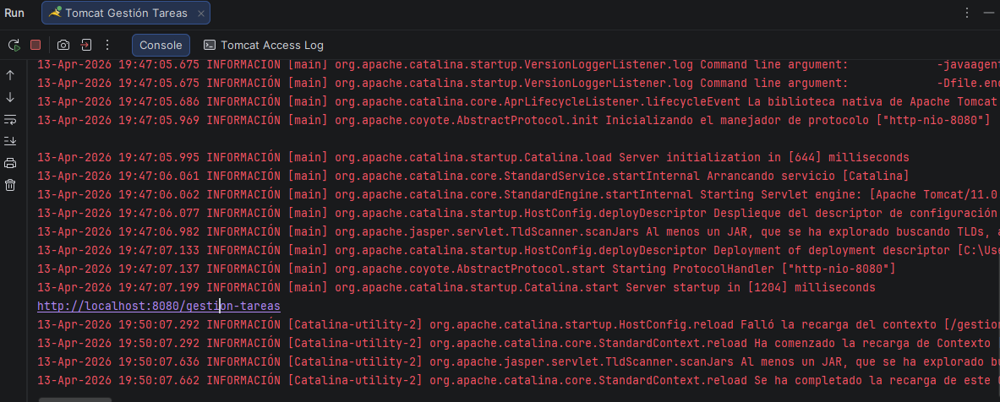
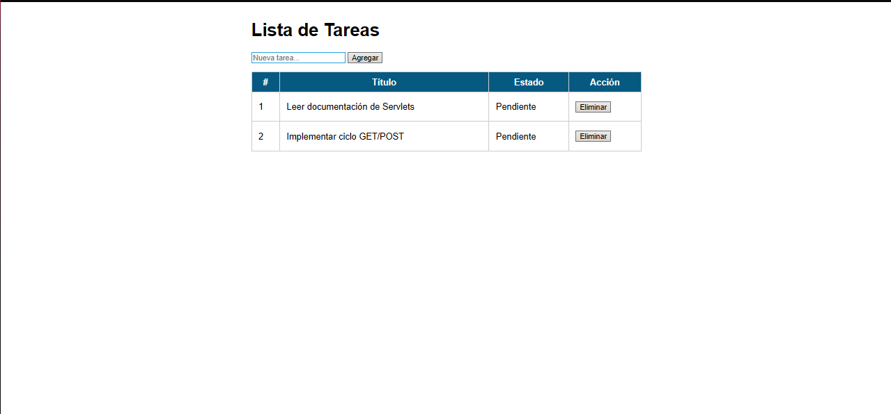
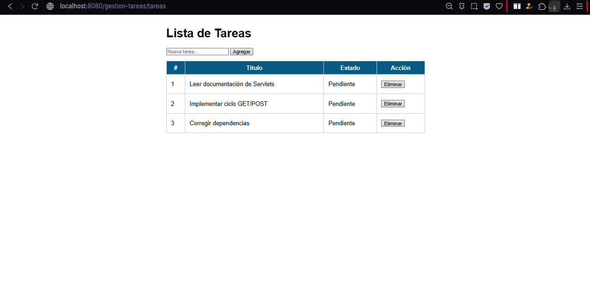
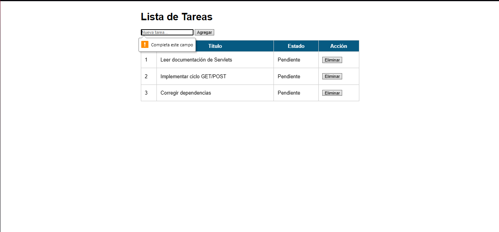
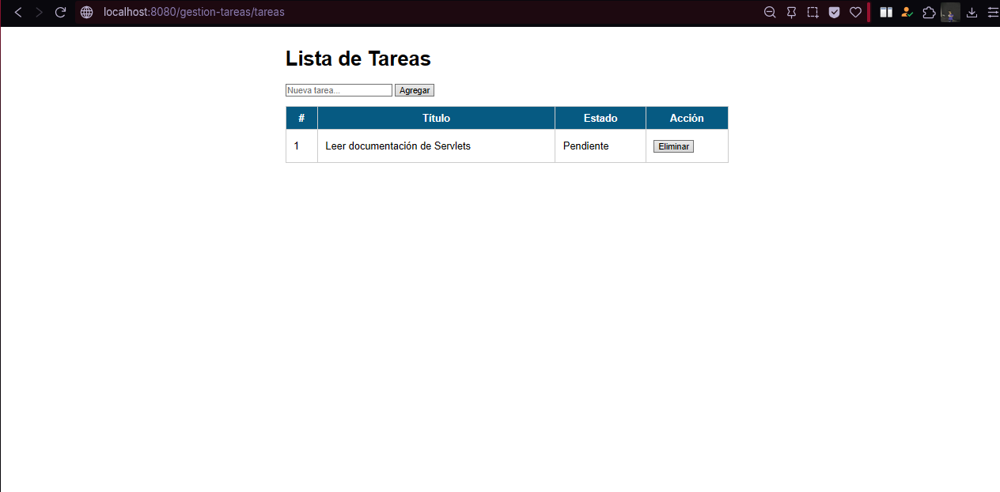

# Gestión de Tareas con Servlets y JSP

## Autor

**Nombre:** Jhoseth Esneider Rozo Carrillo  
**Código:** 02230131027  
**Programa:** Ingeniería de Sistemas  
**Unidad:** Unidad 5 – Fundamentos de Java Web (Servlets y JSP)
**Actividad:** Post-Contenido 1
**Fecha:** 16/04/2026

## Objetivo

Implementar una aplicación web en Java que:

- Procese peticiones HTTP GET y POST
- Gestione datos desde formularios HTML
- Aplique validación en el servidor
- Transfiera datos a una vista JSP usando RequestDispatcher
- Implemente el patrón Post/Redirect/Get (PRG)

---

## Descripción del Proyecto

La aplicación permite gestionar una lista de tareas en memoria:

✔ Listar tareas existentes (GET)  
✔ Agregar nuevas tareas (POST)  
✔ Eliminar tareas por ID (POST)  
✔ Validar datos en el servidor  
✔ Evitar reenvío de formularios con PRG

---

## Tecnologías Utilizadas

- Java 17
- Servlets (Jakarta EE 10)
- JSP + JSTL
- Maven
- Apache Tomcat 10
- HTML5 + CSS

---

## Estructura del Proyecto

gestiontareas
└── src
└── main
├── java
│ └── com.ejemplo
│ ├── model
│ │ └── Tarea.java
│ └── servlet
│ └── TareasServlet.java
└── webapp
├── index.jsp
└── WEB-INF
├── web.xml
└── views
└── tareas.jsp

---

## Configuración del Proyecto

### pom.xml

- Packaging: `war`
- Java: 17
- Dependencias:
  - `jakarta.servlet-api`
  - `jakarta.servlet.jsp.jstl`

---

## Ejecución del Proyecto

### 1. Clonar repositorio

git clone https://github.com/jerc31/rozo-post1-u5.git

### 2. Abrir en IntelliJ IDEA

### 3. Compilar proyecto

### 4. Configurar Apache Tomcat

1. Descargar e instalar Tomcat 10
2. Ejecutar startup.bat
3. Acceder a:
   http://localhost:8080

### 5. Desplegar aplicación

### 6. Ejecutar aplicación

Abrir en el navegador en:
http://localhost:8080/gestiontareas/tareas

---

## Capturas del Proyecto

Las siguientes capturas se encuentran en la carpeta `/evidencias/`:

## App compilando sin errores

## App con lista de 2 tareas

## Agregar nueva tarea

## Mensaje de error

## Eliminar tarea de la lista

